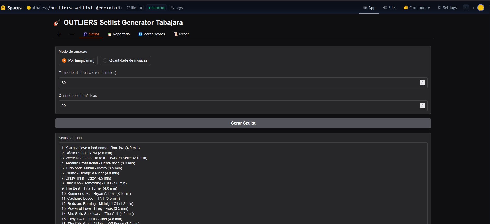

# BAND_SETLIST
Keeps the "repertoire" of songs and can generate "setlists" by time and quantity for band rehearsals and gigs

# LABIRINT

It's an algorithm for a 3D Labirint (simulated) that I invented when I was a kid in 1988. It's just a technic that I created at that time to play and have fun learning MSX Basic and starting C programming at those time.

<table width:100%>
  <tr><b>Python</b></td></tr>
  <tr>
    <td></td>
  </tr>
  <tr>
    </td>
      Running at the Huggin Face Spaces 
      (https://huggingface.co/spaces/athaless/outliers-setlist-generato)
    </td>
  </tr>
</table>
